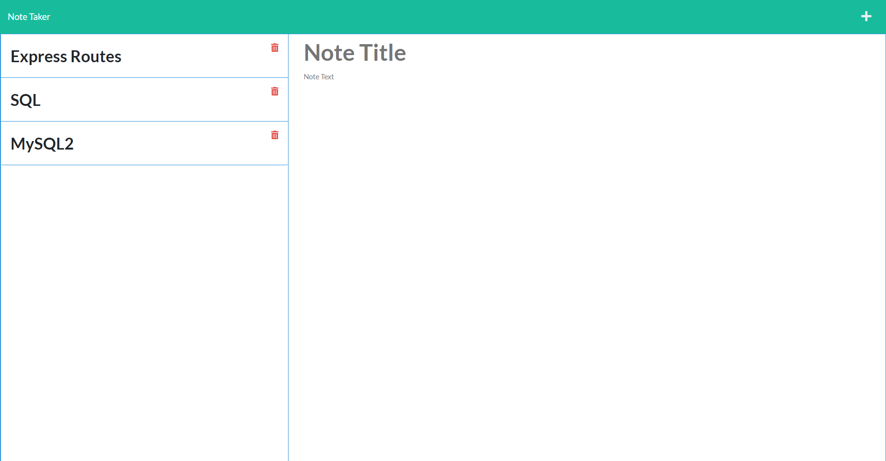

# Note Taker 3000

## Description
Ever wanted a short and easy way to make simple notes without any hassle? 
Some of your employees slacking off and need an efficient way to easily keep tabs on them? 
You answered yes to either of those questions, then boy do I have a treat for you.
Introducing the Note Taker 3000! Not only does it let you dynamically let you create new notes with ease, 
but it also lets you delete them with just as much—if not more—ease then creating them.

## Usage
Just navigate to link provided at the bottom of this document, click on the *Get Started* button and you'll be on your way! 
Enter a note title and description, click the save icon that pops up when you fill out the note, and watch your note appear on the note list on the left. 
Simply click on the delete button next to any note to delete any of them! 
Active link: https://note-taker-4020.herokuapp.com

## Credits
This wonderful, ground-breaking application is brought to you by these brilliant minds:
- Xander Rapstine (Github: Xandromus) : Front-end
- John McCambridge (Github: nol166) : Front-end
- Hunter Bell (Github: HunterBell512) : Back-end routes